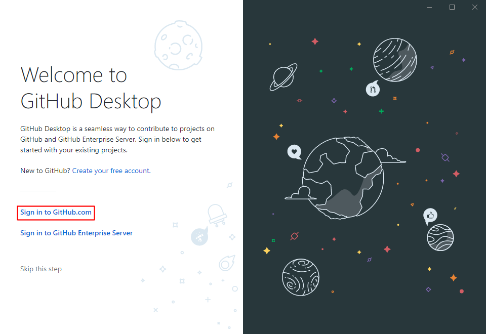
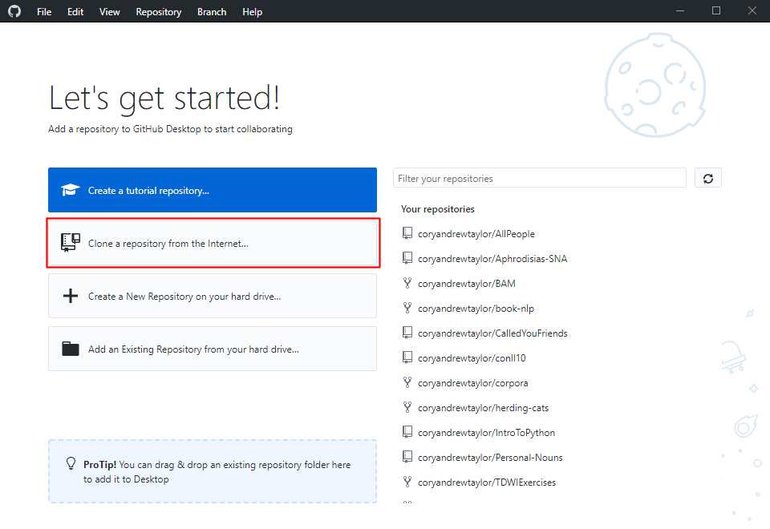
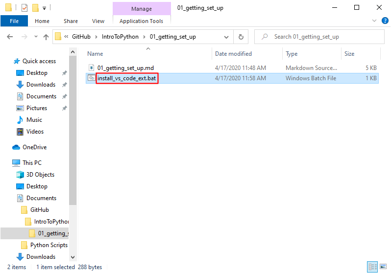

# Installing and Configuring GitHub Desktop

---

Download the GitHub Desktop for Windows installer (https://central.github.com/deployments/desktop/desktop/latest/win32).

Once the download is complete, run the installer (GitHubDesktopSetup.exe).

---

When you run the installer, a splash screen will pop up onscreen.

---

After the splash screen, you will be prompted to sign into GitHub.

Click "Sign in to GitHub.com"

---

On the "Sign in to GitHub.com" screen:

1. Enter your GitHub username and password.
2. Click the "Sign In" button.

---

On the "Configure Git" screen:

1. Enter your name and email address.
2. Click the "Continue" button.

---

On the "Make GitHub Desktop better!" screen:

If you don't want to send data to GitHub, uncheck the the "Yes, send periodic usage stats" checkbox.

Whichever you choose, click the "Finish" button.

---

On the "Let's get started!" page, click "Clone a repository from the Internet..."

---

On the "Clone a repository" page,

1. Enter `https://github.com/coryandrewtaylor/IntroToPython` in the "Repository URL" field.
2. Click the "Clone" button.

---

When the cloning process has completed, the screen will change to show you your local version of the repo.

On the repo screen, click the "Fetch origin" button.

---

When the fetch is complete (the "Fetch origin" button will say "Last fetched just now"), click the "Show in Explorer" button.

---

A File Explorer window will open. Double-click on the folder "01_getting_set_up".

---

Under 01_getting_set_up, double-click on "install_vs_code_ext.bat".

---

A command prompt will appear, showing the progress of the installation.

